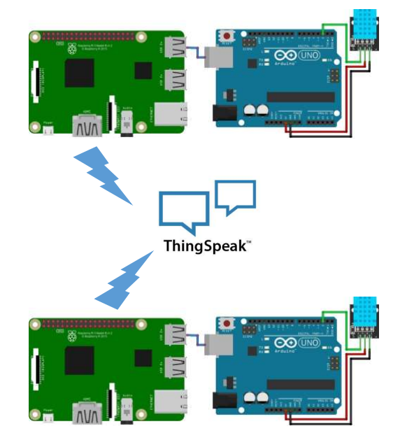

# Anomaly Detection in Temperature Data using Dual Raspberry Pi Gateways and MATLAB Integration on ThingSpeak

## Project Overview
This project involves a system that uses two Arduinos and two Raspberry Pi units to monitor temperatures in different rooms (living room and bedroom) while detecting and handling malicious data alterations. The system reads temperature data from sensors, sends it to a cloud platform (ThingSpeak), and performs data analysis, triggering an alert if the temperature exceeds a defined threshold.

### Components Needed
1. **Microcontrollers**
   - Arduino Uno (2 units)
   
2. **Single Board Computers**
   - Raspberry Pi (2 units, one acting as a malicious gateway and one as a truthful gateway)
   
3. **Sensors**
   - DHT11 Temperature and Humidity Sensor (Living Room)
   - DHT22 Temperature and Humidity Sensor (Bedroom)
   
4. **Other Components**
   - Jumper Wires
   - Breadboard
   - Power Supply

5. **Software and Platforms**
   - MATLAB (for data analysis and email alert setup)
   - ThingSpeak Cloud Platform
   - Python (on Raspberry Pi for data handling)

### IDEs Used
- Arduino IDE (for programming Arduinos)
- Raspbian OS
- VNC Server
- Geany IDE
- ThingSpeak

## Working Principle

1. **Arduino 1 (Living Room):**
   - Reads temperature from the DHT11 sensor.
   - Sends the living room temperature to the malicious Raspberry Pi gateway via USB connection.

2. **Malicious Raspberry Pi:**
   - Reads the data from Arduino via USB.
   - Alters the living room temperature data and sends it to ThingSpeak Field 1.

3. **Arduino 2 (Bedroom):**
   - Reads temperature from the DHT22 sensor.
   - Sends the accurate bedroom temperature to the truthful Raspberry Pi gateway via USB connection.

4. **Truthful Raspberry Pi:**
   - Reads the data from Arduino via USB.
   - Transmits the accurate bedroom temperature to ThingSpeak Field 2.

5. **MATLAB Analysis in ThingSpeak:**
   - Analyzes data from both fields.
   - Triggers an email alert if the temperature exceeds a threshold (e.g., 50°C).

---

## How to Get Started

1. Clone this repository:
   ```bash
   git clone https://github.com/aginasb2109/Temperature-Monitoring-Using-Arduino-and-Raspberrypi-Gateway-with-Malicious-Detection.git
   ```

2. Open the Arduino IDE and load the provided Arduino sketches onto your Arduinos.

3. Set up the Raspberry Pis:
   - One Raspberry Pi will act as the **Malicious Gateway** (modifies data).
   - The other Raspberry Pi will act as the **Truthful Gateway** (transmits real data).

4. Add your API keys in the appropriate places in the code where you see placeholders such as:
   ```python
   readAPIKey = ''  # Add your ThingSpeak API Key here
   alert_api_key = ''  # Add your ThingSpeak Alert API Key here
   ```

5. Set up ThingSpeak:
   - Create a ThingSpeak channel and set up two fields for the living room and bedroom temperatures.
   - Update the code with your ThingSpeak channel ID and field IDs.

6. MATLAB Integration:
   - Use MATLAB to connect to ThingSpeak, retrieve data from both fields, and set up alerts for when the temperature exceeds the threshold.

7. **Run the System**:
   - Once everything is set up, run the system and monitor the data on ThingSpeak.

---


## Project Diagram

Here is the system architecture diagram for better understanding:




